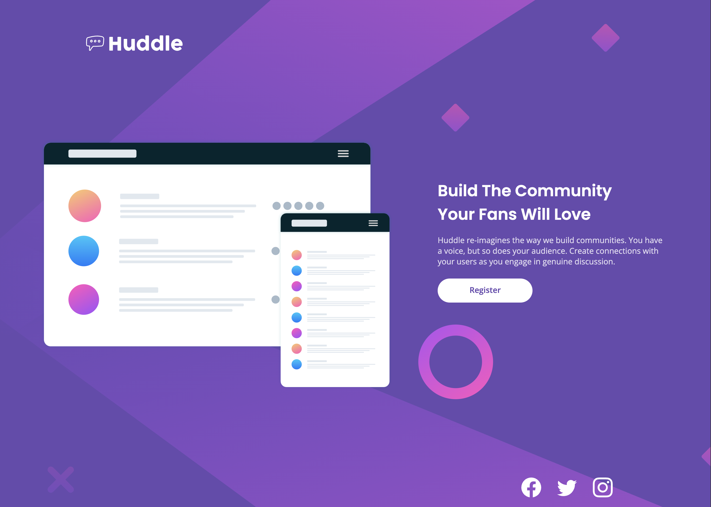

# Huddle landing page

Goal: Responsive Design with flexBox
Tech: HTML & CSS.
Status: complete
Ideas: 
  - Website
  - community web
  - simple landing page

## Error

### Description
 This challenge focus on simple responsive web design, the objective is to improve and understand how mobile first works.

 ### Wrong Face throughout the project
   - Break layout 
   - conflict between Desktop and Mobile First
   - 
  ### Filed
    > I have to face it every time I structure my code to find some error. Semantic HTML looks great when I have done it, but I have to give structure for every block to do something good after that. Sometimes I deleted everything and created it again and again and again, but nothing worked. Well, I forced my brain to think enough, but nothing has changed. The icon broke itself because its path has a custom size, and I have to personalize and use and this gave another broken layout; the icon doesn't work with flexbox, I have to learn a new attribute to make the icon work.

> Other Failed was when creating the mobile design; the image mockup don't was working in terms of size, spacing, etc. Information on the page are break on the middle responsive, and I had to fix it. This took me 3 days.

### Fix
  Actually, I solved every layout page focus on the challenge description. I had to read the documentation and read other code to solve it:
      - flexbox
      - responsive web design focus on 375-wide smaller
      - fix conflicts between Desktop and mobile design; I have to remove unnecessary flexbox code on desktop spacing to make responsive mobile work.

### Rule Learn 
"Face your errors every single day, try to find what makes your layout break, rest, but don't give up"

### related

 I learned how to use attributes as: 
  - object-fit: -> to make image content visible;
  - background-position: to position the image on desktop and mobile.
  - background-size: to set a real image size to fill the entire web page.
  - How to control your flexbox so you don't get a conflict.
